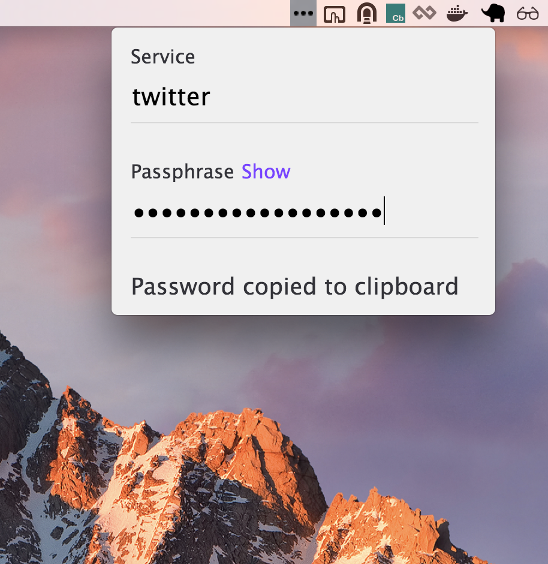

# Vault desktop

- [Intro](#intro)
- [Install](#install)
- [Development](#development)

### Intro

Using 1password? Great. But unless you use it only on offline mode your
passwords are now managed by a third-party corporation. Should you trust them?
No. Trust no one.

[Vault](https://github.com/jcoglan/vault/) is designed to be stateless, that is,
your passwords are not stored anywhere. All you need is to remember one
passphrase. The combination of this passphrase and the service name (e.g.
"twitter") will generate a unique and safe password for you.

Vault desktop is a simple desktop UI on top of
[vault](https://github.com/jcoglan/vault/) using
[Electron](http://electron.atom.io/).

Check it out:



### Install

Download:

- [Mac x64](./vault-desktop-darwin-x64/vault-desktop.zip)
- Windows TBD
- Linux TBD

### Development

```bash
# Clone this repository
git clone https://github.com/joaomilho/vault-desktop
# Go into the repository
cd vault-desktop
# Install dependencies
yarn install
# Run the app
yarn start
```

## License

[CC0 1.0 (Public Domain)](LICENSE.md)
